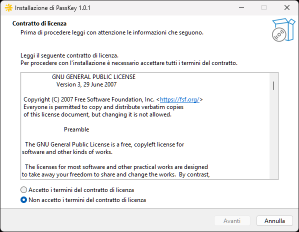
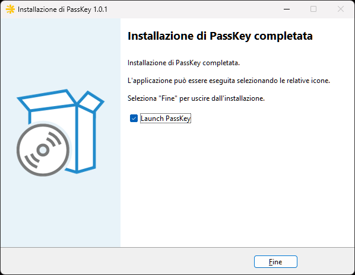

# PassKey

[](https://github.com/pexatar/PassKey/actions/workflows/ci.yml)
[](https://www.gnu.org/licenses/gpl-3.0)
[]()
[]()
[]()

> Open-source password manager for Windows — encrypted, offline-first, no cloud required.

PassKey stores your passwords, credit cards, identities, and secure notes in a locally encrypted vault. Your data never leaves your computer. There are no accounts to create, no subscription fees, and no servers that can be breached.


---

## ✨ Features

### Vault
- **AES-256-GCM** encryption with per-blob random nonces and 128-bit authentication tags
- **Dual KDF**: Argon2id (64 MB, 3 iterations, 4 threads) for new vaults; PBKDF2-SHA256 (600,000 iterations) for backward compatibility
- **Password entries** with title, URL, username, password, notes, and custom icon (letter avatar / Segoe MDL2 glyph / uploaded image)
- **Credit card management** with automatic network detection (Visa, Mastercard, Amex, Discover, JCB, Maestro, Diners) and real-time Luhn validation
- **Identity profiles** with personal data, postal address, and government document fields
- **Secure notes** with 10 categories and a pastel colour palette
- **Password generator** — configurable length (8–128), charset (uppercase/lowercase/digits/symbols), entropy display
- **Password strength analyser** with estimated crack-time and actionable suggestions
- **Password verifier** against known breach patterns
- **Dashboard** with vault statistics

### Security
- Zero-knowledge design: the master password is never stored or transmitted
- DEK held in `PinnedSecureBuffer` (GCHandle Pinned + CryptographicOperations.ZeroMemory on dispose)
- Auto-clear clipboard after 30 seconds with Windows clipboard history suppression
- `passkey://` URL scheme handler for protocol activation

### Import & Backup
- Import from **CSV** (generic), **Bitwarden** JSON export, **1Password** `.1pux` archive
- Encrypted backup/restore (`.pkbak` format — Argon2id-protected AES-GCM blob)

### Browser Extension
- Extensions for **Chrome** (Manifest V3) and **Firefox** (Manifest V3)
- In-extension vault unlock — enter your master password directly in the browser popup
- **One-click autofill** for username and password fields
- Supports standard HTML forms, **React**, **Angular**, and **Vue** virtual DOM
- Multi-step login form support (email-only step 1)
- ECDH P-256 + HKDF-SHA256 + AES-256-GCM ephemeral session encryption for all IPC messages

### Accessibility & i18n
- **WCAG AA** compliant: ARIA labels, live regions, custom `AutomationPeer`, focus rings
- Full keyboard navigation: `Ctrl+N` `Ctrl+F` `Ctrl+L` `F2` `Del` `Esc` `Ctrl+1–7`
- **6 languages**: Italian, English, French, German, Spanish, Portuguese

---

## 📥 Download & Install

| Version | Platform | Type |
|---------|----------|------|
| [v1.0.1](https://github.com/pexatar/PassKey/releases/tag/v1.0.1) | Windows x64 | Installer EXE |
| [v1.0.1](https://github.com/pexatar/PassKey/releases/tag/v1.0.1) | Windows x64 | Portable ZIP |

> **Requirements:** Windows 10 version 1809 (build 17763) or later, x64 processor.
> No .NET runtime required — PassKey is fully self-contained.

> ⚠️ **SmartScreen warning:** PassKey v1.0 is signed with a self-signed certificate. Windows may show an "Unknown publisher" warning. Click **More info → Run anyway** to proceed. This will be resolved with a commercial certificate in a future release.

---

## 🔌 Browser Extensions

| Browser | Store |
|---------|-------|
| Chrome | [Chrome Web Store](https://chrome.google.com/webstore) *(coming soon)* |
| Firefox | [Firefox Add-ons (AMO)](https://addons.mozilla.org) *(coming soon)* |

The browser extension requires PassKey Desktop to be installed and running. See the [Browser Extension guide](docs/user-guide/06-browser-extension.md) for installation instructions.

---

## 📸 Screenshots

### Application

<p align="center">
  
  
</p>
<p align="center">
  
  
</p>
<p align="center">
  
  
</p>
<p align="center">
  
  
</p>

### Installer

<p align="center">
  
  
</p>

---

## 🏗️ Architecture at a Glance

```
PassKey.sln
├── src/PassKey.Core            # Domain models, crypto, services — AOT-ready class library
├── src/PassKey.Desktop         # WinUI 3 app — MVVM ViewModel-first, DI via constructor
├── src/PassKey.BrowserHost     # Native Messaging bridge (stdio ↔ Named Pipe)
└── src/PassKey.Tests           # xUnit test suite (167+ deterministic tests)

extensions/
├── chrome/                     # Chrome Manifest V3 extension
└── firefox/                    # Firefox Manifest V3 extension
```

For a detailed description see [docs/developer/architecture.md](docs/developer/architecture.md).

---

## 🛠️ Build from Source

### Prerequisites
- Windows 10/11 x64
- [Visual Studio 2022 Preview](https://visualstudio.microsoft.com/vs/preview/) with "Windows application development" workload
- [.NET 10 SDK](https://dotnet.microsoft.com/download/dotnet/10.0)
- Windows App SDK 1.8 (installed via VS workload)

### Steps

```bash
git clone https://github.com/pexatar/PassKey.git
cd PassKey
dotnet restore PassKey.sln

# Build all projects (Platform=x64 is required for PassKey.Desktop)
dotnet build PassKey.sln -p:Platform=x64
```

See [docs/developer/build-and-test.md](docs/developer/build-and-test.md) for detailed build instructions and known pitfalls.

---

## 🧪 Running Tests

```bash
dotnet test src/PassKey.Tests/PassKey.Tests.csproj --verbosity normal
```

All 167+ tests are deterministic and run without any external dependencies.

---

## 🤝 Contributing

Contributions are welcome! Please read [CONTRIBUTING.md](CONTRIBUTING.md) before submitting a pull request.

---

## 🔒 Security

PassKey handles sensitive cryptographic key material. Please read [SECURITY.md](SECURITY.md) for:
- How to report vulnerabilities privately
- The cryptographic design and threat model
- Known limitations

---

## 🙏 Acknowledgements

PassKey was conceived and designed by **Giuseppe Imperato**.

Its realization was made possible through the extensive assistance of
[Claude](https://www.anthropic.com/claude) by Anthropic—an AI assistant
that helped architect, write and review code, debug, and document the
entire project across dozens of development sessions (and 35 failed attempts).

This project is a demonstration of human-AI collaboration in building a
project where the vision was clear, but the technical skills were distinctly
lacking. As the saying goes: "this is not the finish line, but rather a
starting point"; it is my hope, therefore, that this project can serve as
an inspiration for anyone.

---

## 📄 License

PassKey is free software: you can redistribute it and/or modify it under the terms of the
[GNU General Public License v3.0](LICENSE) as published by the Free Software Foundation.

Copyright (C) 2026 Giuseppe Imperato
